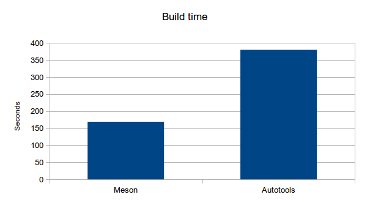
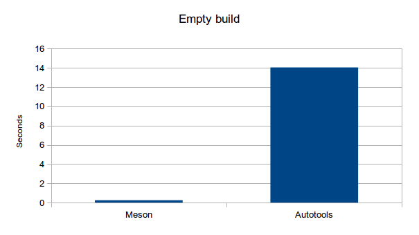
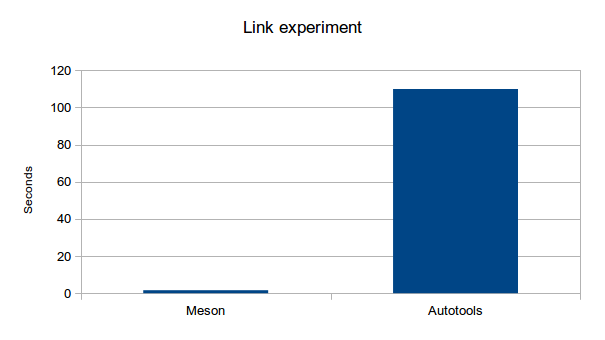

# Arm performance test

Performance differences in build systems become more apparent on
slower platforms. To examine this difference we compared the
performance of Meson with GNU Autotools. We took the GLib software
project and rewrote its build setup with Meson. GLib was chosen
because it is a relatively large C code base which requires lots of
low level configuration.

The Meson version of the build system is not fully equivalent to the
original Autotools one. It does not do all the same configuration
steps and does not build all the same targets. The biggest missing
piece being internationalisation support with Gettext. However it does
configure the system enough to build all C source and run all unit
tests.

All measurements were done on a Nexus 4 smart phone running the latest
Ubuntu touch image (updated on September 9th 2013).

Measurements
------

The first thing we measured was the time it took to run the configure step.

Meson takes roughly 20 seconds whereas Autotools takes 220. This is a
difference of one order of magnitude. Autotools' time contains both
autogen and configure. Again it should be remembered that Meson does
not do all the configure steps that Autotools does. It does do about
90% of them and it takes just 10% of the time to do it.

Then we measured the build times. Two parallel compilation processes
were used for both systems.

On desktop machines Ninja based build systems are 10-20% faster than
Make based ones. On this platform the difference grows to 50%. The
difference is probably caused by Make's inefficient disk access
patterns. Ninja is better at keeping both cores running all the time
which yields impressive performance improvements.

Next we measured the "empty build" case. That is, how long does it
take for the build system to detect that no changes need to be
made. This is one of the most important metrics of build systems
because it places a hard limit on how fast you can iterate on your
code. Autotools takes 14 seconds to determine that no work needs to be
done. Meson (or, rather, Ninja) takes just one quarter of a second.

One step which takes quite a lot of time is linking. A common case is
that you are working on a library and there are tens of small test
executables that link to it. Even if the compilation step would be
fast, relinking all of the test executables takes time. It is common
for people to manually compile only one test application with a
command such as `make sometest` rather than rebuild everything.

Meson has an optimization for this case. Whenever a library is
rebuilt, Meson inspects the ABI it exports. If it has not changed,
Meson will skip all relinking steps as unnecessary. The difference
this makes can be clearly seen in the chart above. In that test the
source was fully built, then the file `glib/gbytes.c` was touched to
force the rebuild of the base glib shared library. As can be seen,
Autotools then relinks all test executables that link with glib. Since
Meson can detect that the ABI is the same it can skip those steps. The
end result being that Meson is almost one hundred times faster on this
very common use case.

Conclusions
-----

One of the main drawbacks of C and C++ compared to languages such as
Java are long compilation times. However at least some of the blame
can be found in the build tools used rather than the languages
themselves or their compilers. Choosing proper tools can bring C and
C++ compilation very close to instantaneous rebuilds. This has a
direct impact on programmer productivity.
