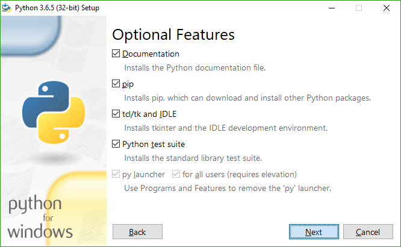

# Obtendo o Meson

Meson é implementado em Python 3, e requer a versão 3.7 ou mais nova.
se o seu sistema operacional provê um gerenciador de pacotes, você deve
instalar o Meson com ele. Para plataformas que não tem um gerenciador de
pacotes, você precisa baixa-lo da [página inicial do Python]. Veja abaixo
[peculiaridades do Python3 específicas de plataformas](#platformspecific-install-quirks).

## Baixando o Meson

*Releases* do Meson podem ser baixadas da [página de releases do GitHub]
e você pode executar `./meson.py` de dentro do *release* ou do próprio repositório
do git sem fazer nada de especial.

No Windows, se você não instalar o Python com a opção do instalador que fazem
os *scripts* Python executáveis, você vai ter que executar `python
/path/to/meson.py`, onde `python` é o Python 3.7 ou mais novo.

O código de desenvolvimento mais recente pode ser obtido diretamente do [Git],
e nós lutamos para garatir que ele vai estar sempre funcionando e usável. Todos
*commits* passam por um processo de *pull-request* que executa CI e testam diversas
plataformas.

## Instalando o Meson com o pip

O Meson está disponível no [Indice de Pacotes do Python] e pode ser instalado com
`sudo pip3 install meson` que requer root e vai instala-lo para todo o sistema.

Se você já baixou uma cópia do código do Meson, você pode instalar com
`sudo pip3 install path/to/source/root/`.

Como alternativa, você pode usar o `pip3 install --user meson` que vai instalar
o Meson para o seu usuário e não requer nenhum privilégio especial. Esse comando
vai instalar o pacote em `~/.local/`, então você terá que adicionar `~/.local/bin`
para o seu `PATH`, e `sudo meson install` vai estar completamente quebrado já que
o programa não vai estar disponível para o root. Apeas use uma cópia de usuário do Meson
se você não se importa sobre instalar os projetos como root.

## Instalando o Meson e o Ninja com o instalador MSI

Nós provemos um instalador MSI na [página de *release* do GitHub] que pode ser usada
para instalar tanto o Meson quanto o Ninja de uma vez para o Windows. O instalador também
contém uma cópia integrada do Python, então scripts que usam o [módulo Python](Python-module.md)
e não tem nenhuma dependência externa vão continuar funcionando como esperado.

Por favor, note que essa é uma funcionalidade nova, então relatórios de bugs são esperados e bem-vindos!

## Dependências

Na maioria dos casos comums, você vai precisar do [executável do Ninja] para usar o *backend* do `ninja`,
que é o padrão no Meson. Esse *backend* pode ser usado em todas plataformas e com todas **toolchains**, incluindo o GCC,
Clang, Visual Studio, MinGW, ICC, ARMCC, etc.

Você deve usar a versão provida pelo seu gerenciador de pacotes se possível, caso contrário,
baixe o binário executável da [página de *release* do projeto Ninja](https://github.com/ninja-build/ninja/releases).

Se você apenas usa o *backend* do Visual Studio (`--backend=vs`) para gerar soluções do Visual Studio no Windows ou o
*backend* do XCode (`--backend=xcode`) para gerar projetos no macOS, você não precisa do Ninja.

# Peculiaridades de instalação específicas de plataformas

## Peculiaridades do Python 3 no Windows

Quando estiver instalando o Python 3, é altamente recomendável (mas não obrigatório)
que você selecione as opções do instalador como a seguir:

Com isso, você terá o `python` e o `pip` no `PATH`, e você poderá instalar o Meson com o pip. Você também vai poder
executar o comando `meson` em qualquer shell no Windows ao invés de ter que executar `py -3` com o caminho completo para
o *script* `meson.py`.

## Peculiaridades do Python 3 no MSYS2

Se você está usando o MSYS2 no Windows como seu ambiente de desenvolvimento,
por favor se certifique que você não esteja usando o pacote `msys/python` para
fornecer o Python 3. Uso o `mingw32/mingw-w64-i686-python3` ou o
If you are using MSYS2 on Windows as your development environment,
please make sure that you **do not use** the `msys/python` package to
provide Python 3. Use either `mingw32/mingw-w64-i686-python3` or `mingw64/mingw-w64-x86_64-python3`
dependendo de para qual *target* do MinGW você está compilando.

  [página de *release* do GitHub]: https://github.com/mesonbuild/meson/releases
  [Indice de Pacotes do Python]: https://pypi.python.org/pypi/meson/
  [Git]: https://github.com/mesonbuild/meson
  [página inicial do Python]: https://www.python.org/downloads/
  [executável do Ninja]: https://ninja-build.org/
