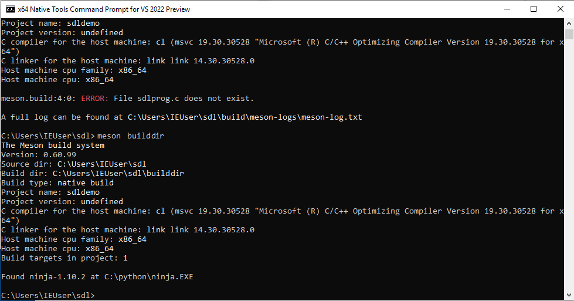
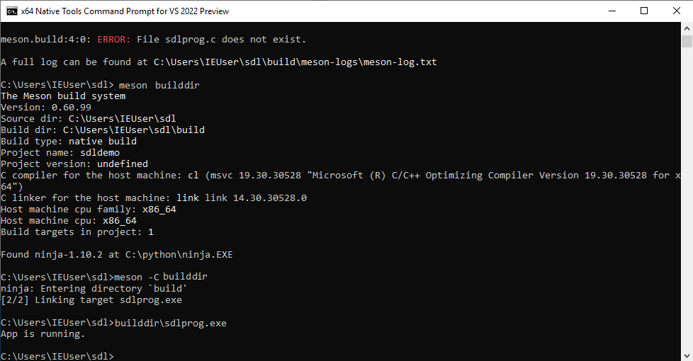
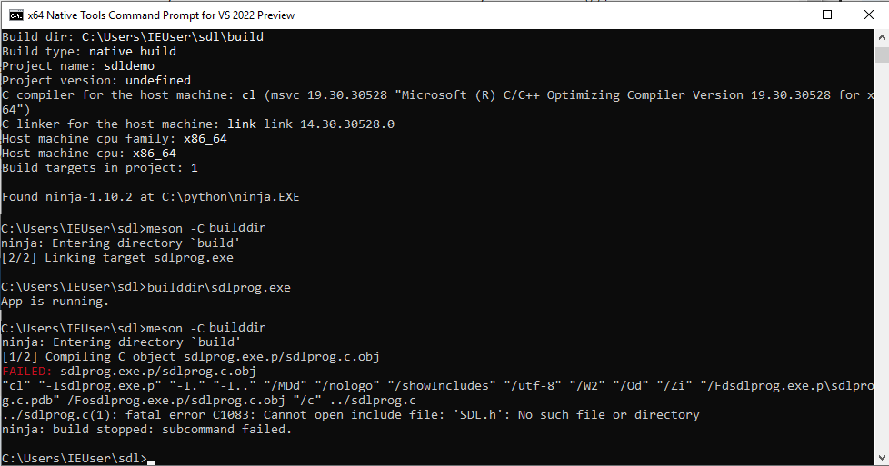
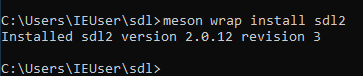
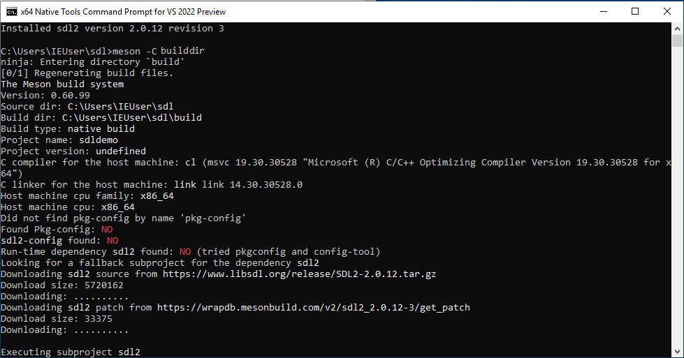
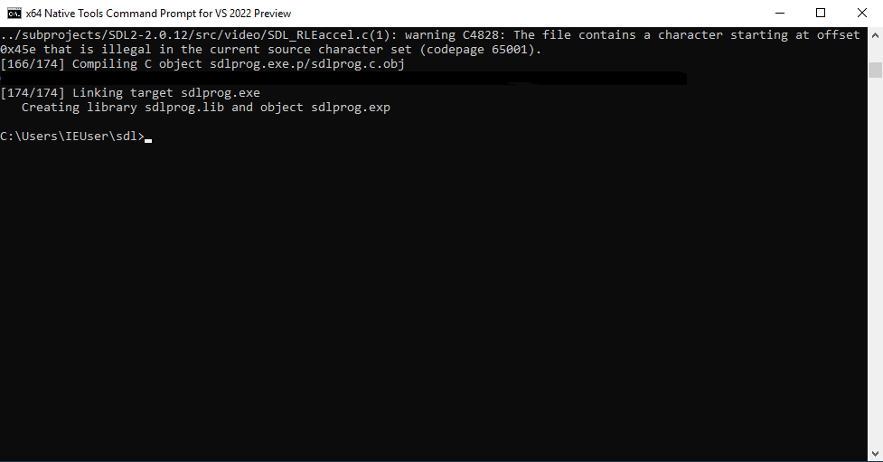
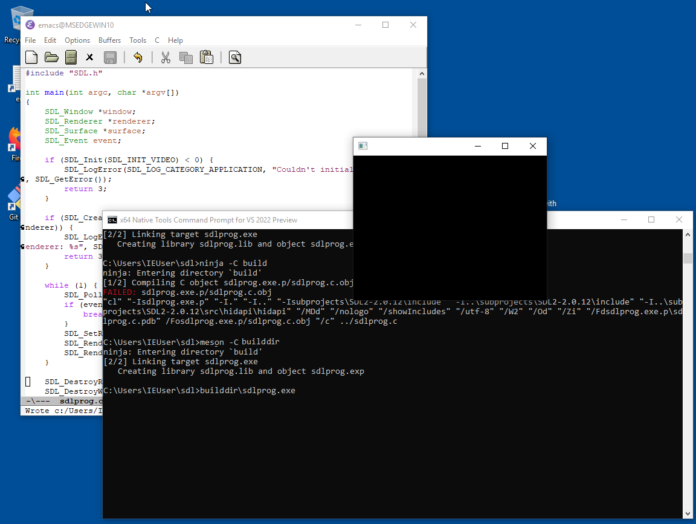

---
short-description: A simple GUI tutorial
...

# Building a simple SDL2 app from scratch

This page shows from the ground up how to define and build an SDL2 gui
application using nothing but Meson. The document is written for
Windows, as it is the most complex platform, but the same basic ideas
should work on Linux and macOS as well.

The sample application is written in plain C as SDL 2 is also written
in C. If you prefer C++ instead, the conversion is fairly simple and
is left as an exercise to the reader.

This document assumes that you have already installed both Visual
Studio and Meson.

# Set up the build directory

First you need to create an empty directory for all your stuff. The
Visual Studio toolchain is a bit unusual in that it requires you to
run your builds from a specific shell. This can be found by opening
the application menu and then choosing `Visual Studio <year> -> x86_64
native tools command prompt`.

It will put you in a weird directory, so you need to go to your home
directory:

    cd \users\yourusername

Typically you'd type `cd \users\` and then press the tabulator key to
make the shell autocomplete the username. Once that is done you can
create the directory.

    mkdir sdldemo
    cd sdldemo

# Creating the sample program

Now we need to create a source file and a Meson build definition file.
We're not going to use SDL at all, but instead start with a simple
program that only prints some text. Once we have it working we can
extend it to do graphics. The source goes into a file `sdlprog.c` and
has the following contents:

```c
#include <stdio.h>

int main(int argc, char **argv) {
  printf("App is running.\n");
  return 0;
}
```

The build definition goes to a file called `meson.build` and looks
like this:

```meson
project('sdldemo', 'c')

executable('sdlprog', 'sdlprog.c')
```

With this done we can start the build with the following command:

    meson setup builddir

Here `builddir` is the _build directory_, everything that is generated
during the build is put in that directory. When run, it should look
like this.



The program is compiled with this:

    meson compile -C builddir

The `-C` argument tells Meson where the configured build directory is.

The program will be in the build directory and can be run like this:

    builddir\sdlprog

The output should look like this.



# Upgrading the program to use SDL

The code needed to start SDL is a bit more complicated and we're not
going to go into how it works. Merely replace the contents of
`sdlprog.c` with the following:

```c
#include "SDL.h"

int main(int argc, char *argv[])
{
    SDL_Window *window;
    SDL_Renderer *renderer;
    SDL_Surface *surface;
    SDL_Event event;

    if (SDL_Init(SDL_INIT_VIDEO) < 0) {
        SDL_LogError(SDL_LOG_CATEGORY_APPLICATION, "Couldn't initialize SDL: %s", SDL_GetError());
        return 3;
    }

    if (SDL_CreateWindowAndRenderer(320, 240, SDL_WINDOW_RESIZABLE, &window, &renderer)) {
        SDL_LogError(SDL_LOG_CATEGORY_APPLICATION, "Couldn't create window and renderer: %s", SDL_GetError());
        return 3;
    }

    while (1) {
        SDL_PollEvent(&event);
        if (event.type == SDL_QUIT) {
            break;
        }
        SDL_SetRenderDrawColor(renderer, 0x00, 0x00, 0x00, 0x00);
        SDL_RenderClear(renderer);
        SDL_RenderPresent(renderer);
    }

    SDL_DestroyRenderer(renderer);
    SDL_DestroyWindow(window);

    SDL_Quit();

    return 0;
}
```

Let's try to compile this by running `meson compile -C builddir` again.



That fails. The reason for this is that we don't actually have SDL
currently available. We need to obtain it somehow. In more technical
terms SDL2 is an _external dependency_ and obtaining it is called
_dependency resolution_.

Meson has a web service for downloading and building (if needed)
dependencies called a WrapDB. It provides SDL2 so we can use it
directly. First we need to create a `subprojects` directory because in
Meson all subprojects like these must be stored in that directory for
consistency.

    mkdir subprojects

Then we can install the dependency:

    meson wrap install sdl2

It looks like this:



As a final step we need to update our build definition file to use the
newly obtained dependency.

```meson
project('sdldemo', 'c',
        default_options: 'default_library=static')

sdl2_dep = dependency('sdl2')

executable('sdlprog', 'sdlprog.c',
           win_subsystem: 'windows',
           dependencies: sdl2_dep)
```

**NOTE:** If you're on Windows you need to include the sdl2main dependency as well; To do so you can modify the above build script like so:

```meson
project('sdldemo', 'c',
        default_options: 'default_library=static')

sdl2_dep = dependency('sdl2')
sdl2_main_dep = dependency('sdl2main')

executable('sdlprog', 'sdlprog.c',
           win_subsystem: 'windows',
           dependencies: [sdl2_dep, sdl2_main_dep])
```

In addition to the dependency this has a few other changes. First we
specify that we want to build helper libraries statically. For simple
projects like these it makes things simpler. We also need to tell
Meson that the program we are building is a Windows GUI
application rather than a console application.

This is all we need to do and can now run `meson compile` again. First
the system downloads and configures SDL2:



A bit later the compilation exits successfully.



# Program is done

Now we can run the application with

    builddir\sdlprog

The end result is a black SDL window.


