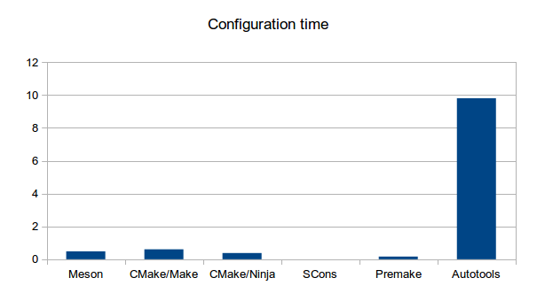

# A simple comparison

In this experiment we generated one thousand C files with contents
that looked like this.

```c
#include<stdio.h>
#include"header.h"

int func23() { return 0; }
```

The function number was different in each file. In addition there was
a main C file that just called each function in turn. We then
generated build system files for *Meson*, *CMake*, *SCons*, *Premake*
and *Autotools* that compiled these files into a single executable.

With this we measured three different things. The first is
configuration time, that is, the time the build system takes to
generate necessary build files. This is usually called the *configure
step*. The time was measured in seconds.

The second thing to measure was the build time. This should be limited
by the compiler and in the optimal case should be the same for every
build system. Four parallel processes were used in this test.

The third thing we measured was the empty build time. This measures
how much time the build system takes to check the states of all source
files because if any of them could potentially cause a rebuild.

Since CMake has two different backends, Make and Ninja, we ran the
tests on both of them. All tests were run on a 2011 era Macbook Pro
running Ubuntu 13/04. The tests were run multiple times and we always
took the fastest time.

Here are the results for configuration time.



The reason SCons got zero seconds on this test is because you cannot
separate configure and build steps. They run as one unit. Autotools is
the clear loser of this test as it is over an order of magnitude
slower than the second slowest one. This configuration time includes
both autogen and configure. All other systems take less than one
second to do this setup, which is fast enough for a human being to
interpret as instantaneous.


Build times are a bit more even. SCons is the slowest, being almost
ten seconds slower than the second slowest. Some of it is work from
the configure step but it still has the worst performance. Premake is
the fastest Make-based build system narrowly beating out Autotools.
Both Ninja-based build systems are faster than all non-Ninja ones with
Meson being slightly faster. In practice the difference is minimal.
The advantages of Ninja can be seen by comparing CMake's times when
using Make or Ninja. It is possible to shave off 3.5 seconds (over
20%) of the total build time just by changing the backend. The
project's CMake configuration files don't need any changes.


Empty build times reflect the performance of regular build times.
SCons is again the slowest taking over three seconds compared to
Meson, which takes only 0.03 seconds, a difference of two orders of
magnitude. Even Autotools, the fastest Make-based system, is almost
one order of magnitude slower. Ninja holds the top spots just like in
the previous test.

Conclusions
-----

Build system performance matters. Even with this extremely simple
example we can find differences between various popular build systems.
As the project size increases, these differences grow even larger.
(The author has witnessed no-op build times of 30 seconds for Make
versus less than one second for Ninja when compiling the Clang
compiler.) Keeping incremental build times low is one of the major
keys of programmer productivity as it allows developers to iterate
faster and stay in the creative zone.

Original scripts
-----

Those who want to run these experiments themselves can download the scripts here:

* [Generator script](https://raw.githubusercontent.com/wiki/jpakkane/meson/gen_src.py)
* [Measurement script](https://raw.githubusercontent.com/wiki/jpakkane/meson/measure.py)
