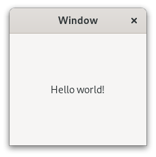

---
short-description: Simplest tutorial
...

# Tutorial

This page shows from the ground up how to create a Meson build
definition for a simple project. Then we expand it to use external
dependencies to show how easily they can be integrated into your
project.

This tutorial has been written mostly for Linux usage. It assumes that
you have GTK development libraries available on the system. On
Debian-derived systems such as Ubuntu they can be installed with the
following command:

```
sudo apt install libgtk-3-dev
```

In addition, it is recommended to have the glib library with version 2.74 or higher.

It is possible to build the GUI application on other platforms, such
as Windows and macOS, but you need to install the needed dependencies.

The humble beginning
-----

Let's start with the most basic of programs, the classic hello
example. First we create a file `main.c` which holds the source. It
looks like this.

```c
#include <stdio.h>

//
// main is where all program execution starts
//
int main(int argc, char **argv) {
  printf("Hello there.\n");
  return 0;
}
```

Then we create a Meson build description and put it in a file called
`meson.build` in the same directory. Its contents are the following.

```meson
project('tutorial', 'c')
executable('demo', 'main.c')
```

That is all. Note that unlike Autotools you [do not need to add any
source headers to the list of
sources](FAQ.md#do-i-need-to-add-my-headers-to-the-sources-list-like-in-autotools).

We are now ready to build our application. First we need
to initialize the build by going into the source directory and issuing
the following commands.

```console
$ meson setup builddir
```

We create a separate build directory to hold all of the compiler
output. Meson is different from some other build systems in that it
does not permit in-source builds. You must always create a separate
build directory. Common convention is to put the default build
directory in a subdirectory of your top level source directory.

When Meson is run it prints the following output.

    The Meson build system
     version: 0.13.0-research
    Source dir: /home/jpakkane/mesontutorial
    Build dir: /home/jpakkane/mesontutorial/builddir
    Build type: native build
    Project name is "tutorial".
    Using native c compiler "ccache cc". (gcc 4.8.2)
    Creating build target "demo" with 1 files.

Now we are ready to build our code.


```console
$ cd builddir
$ ninja
```

If your Meson version is newer than 0.55.0, you can use the new
backend-agnostic build command:

```console
$ cd builddir
$ meson compile
```

For the rest of this document we are going to use the latter form.

Once the executable is built we can run it.

```console
$ ./demo
```

This produces the expected output.

    Hello there.

Adding dependencies
-----

Just printing text is a bit old fashioned. Let's update our program to
create a graphical window instead. We'll use the
[GTK+](https://gtk.org) widget toolkit. First we edit the main file to
use GTK+. The new version looks like this.

```c

#include <gtk/gtk.h>

//
// Should provided the active view for a GTK application
//
static void activate(GtkApplication* app, gpointer user_data)
{
  GtkWidget *window;
  GtkWidget *label;

  window = gtk_application_window_new (app);
  label = gtk_label_new("Hello GNOME!");
  gtk_container_add (GTK_CONTAINER (window), label);
  gtk_window_set_title(GTK_WINDOW (window), "Welcome to GNOME");
  gtk_window_set_default_size(GTK_WINDOW (window), 400, 200);
  gtk_widget_show_all(window);
} // end of function activate

//
// main is where all program execution starts
//
int main(int argc, char **argv)
{
  GtkApplication *app;
  int status;

#if GLIB_CHECK_VERSION(2, 74, 0)
  app = gtk_application_new(NULL, G_APPLICATION_DEFAULT_FLAGS);
#else
  app = gtk_application_new(NULL, G_APPLICATION_FLAGS_NONE);
#endif
  g_signal_connect(app, "activate", G_CALLBACK(activate), NULL);
  status = g_application_run(G_APPLICATION(app), argc, argv);
  g_object_unref(app);

  return status;
} // end of function main
```

Then we edit the Meson file, instructing it to find and use the GTK+
libraries.

```meson
project('tutorial', 'c')
gtkdep = dependency('gtk+-3.0')
executable('demo', 'main.c', dependencies : gtkdep)
```

If your app needs to use multiple libraries, you need to use separate
[[dependency]] calls for each, like so:

```meson
gtkdeps = [dependency('gtk+-3.0'), dependency('gtksourceview-3.0')]
```

We don't need it for the current example.

Now we are ready to build. The thing to notice is that we do *not*
need to recreate our build directory, run any sort of magical commands
or the like. Instead we just type the exact same command as if we were
rebuilding our code without any build system changes.

```console
$ meson compile
```

Once you have set up your build directory the first time, you don't
ever need to run the `meson` command again. You always just run `meson
compile`. Meson will automatically detect when you have done changes
to build definitions and will take care of everything so users don't
have to care. In this case the following output is produced.

    [1/1] Regenerating build files
    The Meson build system
     version: 0.13.0-research
    Source dir: /home/jpakkane/mesontutorial
    Build dir: /home/jpakkane/mesontutorial/builddir
    Build type: native build
    Project name is "tutorial".
    Using native c compiler "ccache cc". (gcc 4.8.2)
    Found pkg-config version 0.26.
    Dependency gtk+-3.0 found: YES
    Creating build target "demo" with 1 files.
    [1/2] Compiling c object demo.dir/main.c.o
    [2/2] Linking target demo

Note how Meson noticed that the build definition has changed and reran
itself automatically. The program is now ready to be run:

```
$ ./demo
```

This creates the following GUI application.


